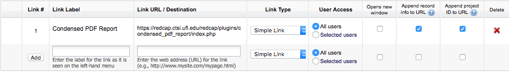

# Condensed PDF Report

The Condensed PDF Report plugin is a REDCap plugin that creates a condensed
version of the report REDCap creates when selecting _This data entry form with
saved data_ from the  _Download PDF of instrument(s)_ menu while viewing a
record. The condensed report only prints fields that have saved data.  This
makes for much shorter reports when printing the records for research subjects
who have sparse data.

The software for this plugin was written by Andy Martin of Stanford University based on original REDCap code by Vanderbilt University and released under the name _PDF Modified Report_.

## Basic Usage

To use the Condensed PDF Report, add a project bookmark titled "Condensed PDF
Report" pointing at the installed plugin.  At the UF CTSI, this plugin is
located at [https://redcap.ctsi.ufl.edu/redcap/plugins/condensed\_pdf\_report/index.php]
(https://redcap.ctsi.ufl.edu/redcap/plugins/condensed_pdf_report/index.php)  Check the
_Append record info to URL_ and _Append project info to URL_ boxes.

This will create a Project Bookmark in the left hand column named "Condensed
PDF Report". To use this bookmark, first access a form for a subject, then
click the bookmark.  This will create and download a PDF of the form you are
viewing at that moment.  The PDF will show only those fields that have data
elements.

## Advanced Usage

You can supply a few optional parameters to specify the form(s) you want to
print and how you want to print them.

If you want to include a field even if it is blank, you should append a comma-
separated list of fields with the _always\_include_ parameter.

    https://redcap.ctsi.ufl.edu/redcap/plugins/condensed_pdf_report/index.php?always_include=consent_date

If you want to exclude a field no matter what, you should append a comma-
separated list of fields with the _always\_exclude_ parameter

    https://redcap.ctsi.ufl.edu/redcap/plugins/condensed_pdf_report/index.php?always_exclude=mrn

You can print multiple forms using the _forms_ parameter.  To print all forms,
set _forms_ to _all_.  To specify multiple forms, specify them in a comma-
separated list.

    https://redcap.ctsi.ufl.edu/redcap/plugins/condensed_pdf_report/index.php?forms=all
    https://redcap.ctsi.ufl.edu/redcap/plugins/condensed_pdf_report/index.php?forms=demographics,cbc

Omitting the list of form names or omitting the form parameter
entirely results in only the current form being printed.  That's the behavior describe above in _Basic Usage_.

Parameters can also be combined:

    https://redcap.ctsi.ufl.edu/redcap/plugins/condensed_pdf_report/index.php
    ?forms=demographics,cbc
    &always_exclude=mrn
    &always_include=consent_date

When making the bookmark, the _Link Label_ field should reflect the contents of the
report generated.
